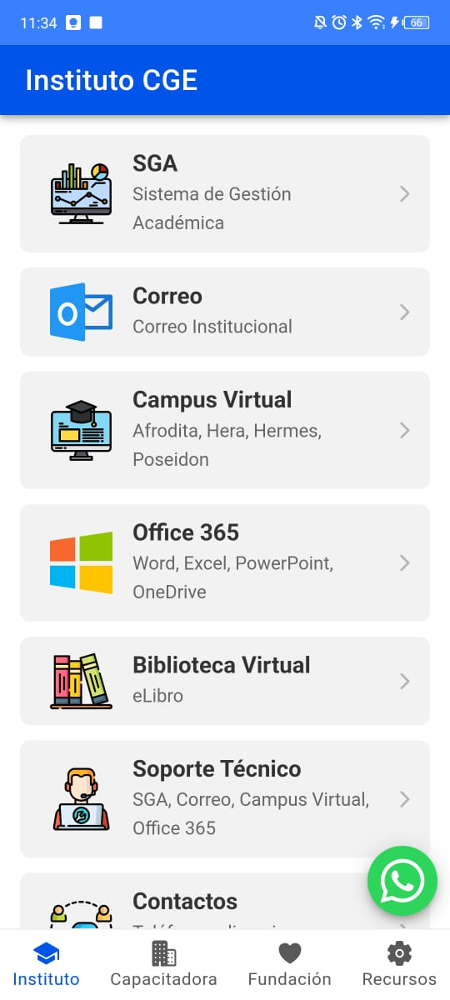
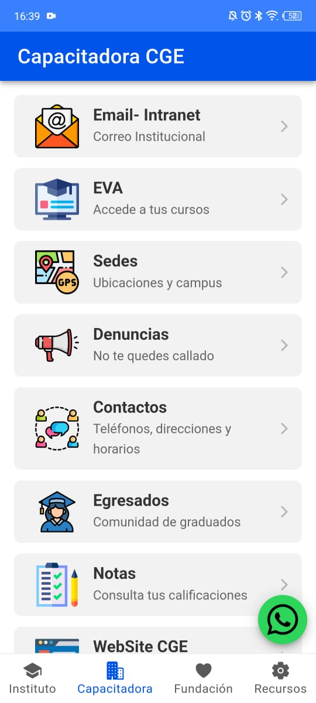
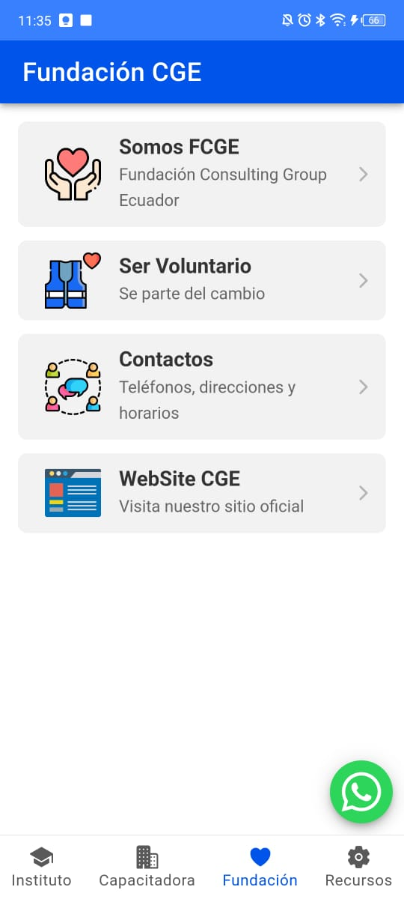
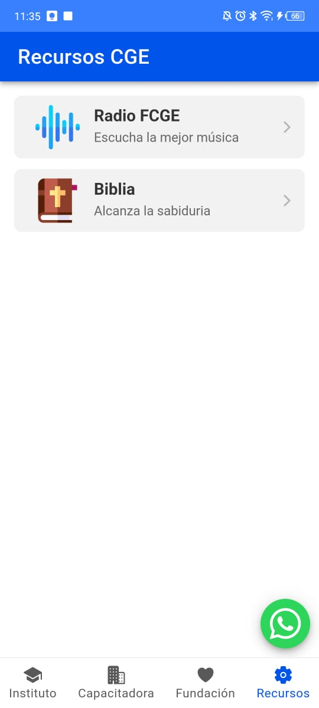

---

# 🚀 Aplicación CGE

📱 Aplicación móvil desarrollada con **Ionic** y **Angular** para centralizar el acceso a los recursos web y servicios principales del **Instituto CGE**, **Capacitadora CGE** y **Fundación CGE**.

---

## 📸 Captura de Pantalla  
<p align="center">
  
  
  
  
</p>

---

## ✨ Características Principales  

✔ **Navegación por Pestañas:** Acceso rápido a:  
   🔹 Instituto CGE  
   🔹 Capacitadora CGE  
   🔹 Fundación CGE  
   🔹 Recursos Adicionales (Radio, Biblia)  

✔ **Accesos Directos:** Enlaces rápidos a SGA, Correo Institucional, Campus Virtual, EVA, Biblioteca Virtual, Office 365, etc.  

✔ **📲 Contacto Rápido:** Botón flotante (FAB) para iniciar una conversación de WhatsApp.  

✔ **⚡ Tecnología Moderna:** Construida con Ionic y Angular para una experiencia fluida y rápida.  

✔ **📱 Multiplataforma:** Funciona en Web, Android e iOS mediante Capacitor.  

✔ **🎨 Interfaz Adaptable:** Diseño responsivo que respeta las *Safe Areas* del dispositivo.  

---

## 🛠 Tecnologías Utilizadas  

| Tecnología       | Descripción |
|-----------------|-------------|
|  | Framework híbrido para apps móviles |
|  | Framework frontend |
|  | Plugins nativos y compatibilidad con móviles |
|  | Lenguaje para mejorar JavaScript |
|  | Estilos personalizados |

---

## 🏗 Instalación y Ejecución  

### 🔹 1. Clona el repositorio  
```bash
git clone <URL_DE_TU_REPOSITORIO>
cd <NOMBRE_DEL_PROYECTO>
```

### 🔹 2. Instala las dependencias  
```bash
npm install
```

### 🔹 3. Ejecuta en el navegador (modo desarrollo)  
```bash
ionic serve
```

### 🔹 4. Construcción y Ejecución en Android/iOS  

#### 📦 Construir el proyecto  
```bash
ionic build
```

#### 📲 Agregar las plataformas  
```bash
npx cap add android
npx cap add ios
```

#### 🔁 Copiar archivos a Capacitor  
```bash
npx cap copy
```

#### 🛠 Abrir en el IDE nativo  
```bash
npx cap open android  # Para Android Studio  
npx cap open ios      # Para Xcode  
```

---

## 🎮 Uso  

1️⃣ Abre la aplicación.  
2️⃣ Navega entre las secciones usando la barra de pestañas.  
3️⃣ Accede a los servicios con un solo toque.  
4️⃣ Usa el botón de WhatsApp para contacto rápido.  

---

## 📜 Licencia  

Este proyecto es de uso interno del **Instituto CGE** y sus entidades asociadas.  

💡 _Creado con 💙 por Jordan Espinosa_  
📅 _Última actualización: Abril 2025_

---
